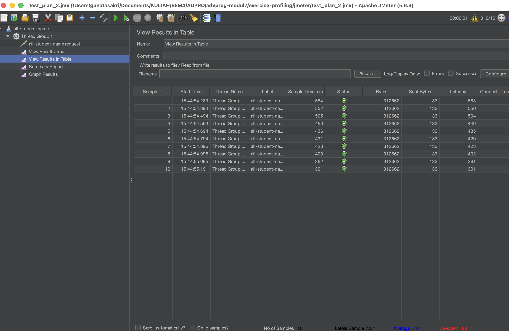
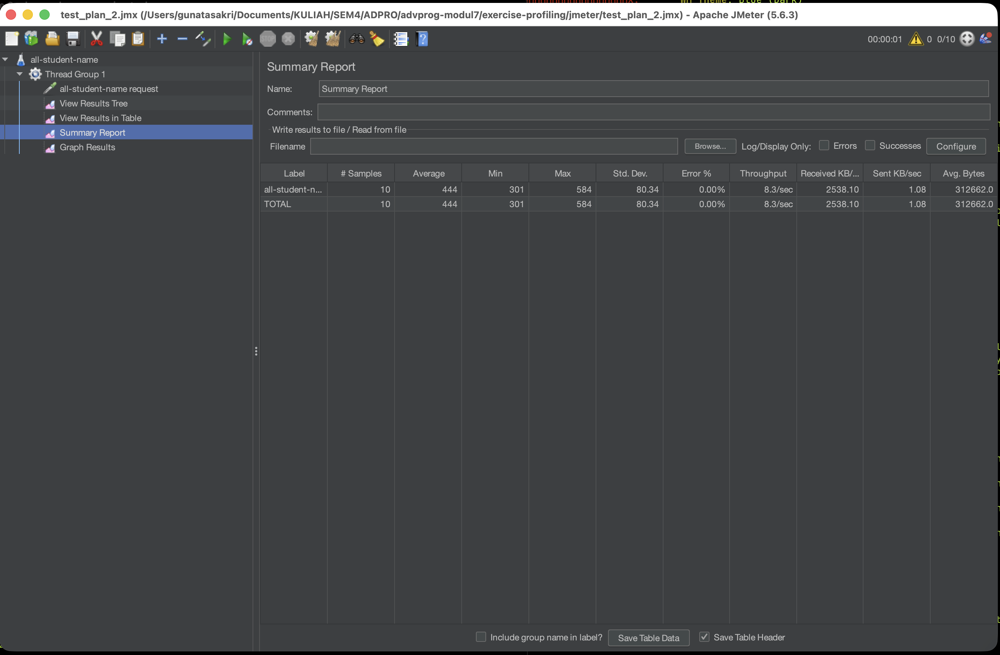
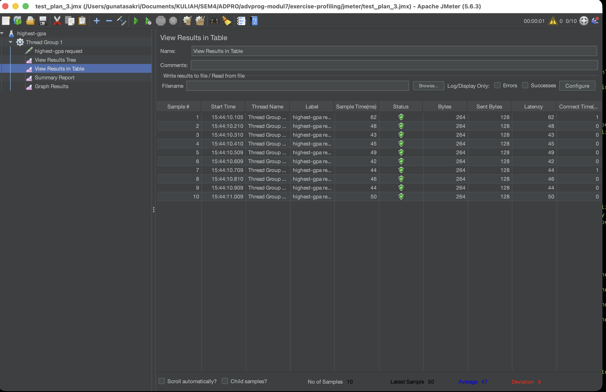
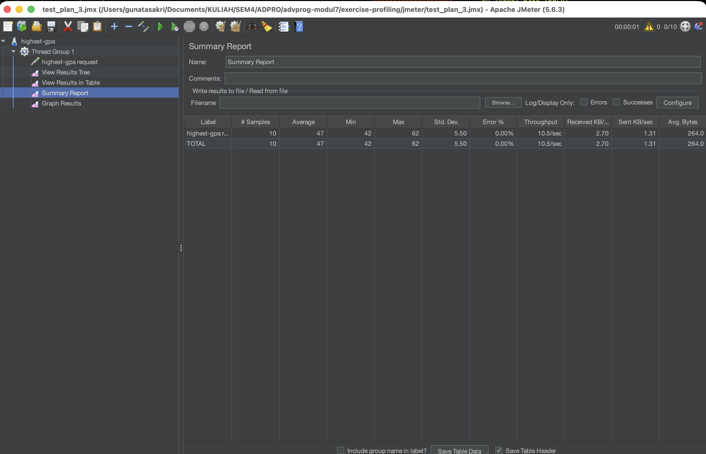
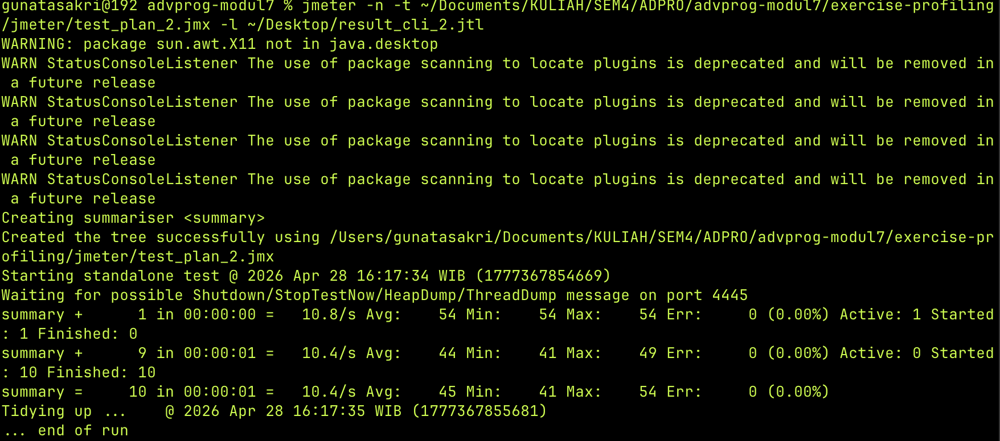
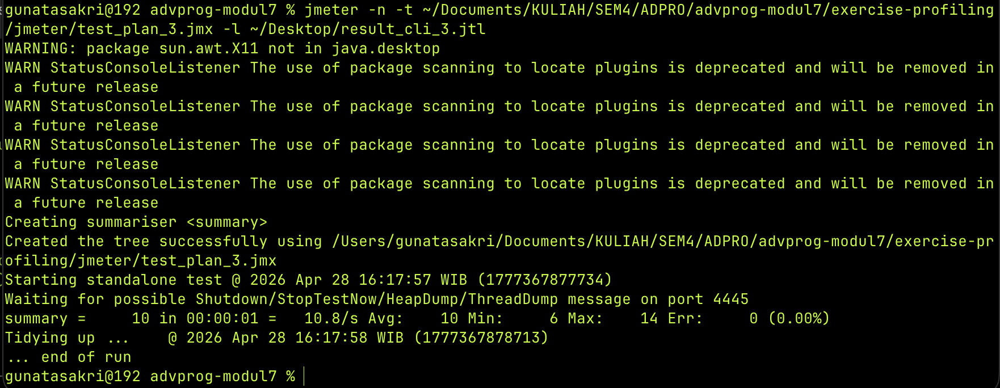
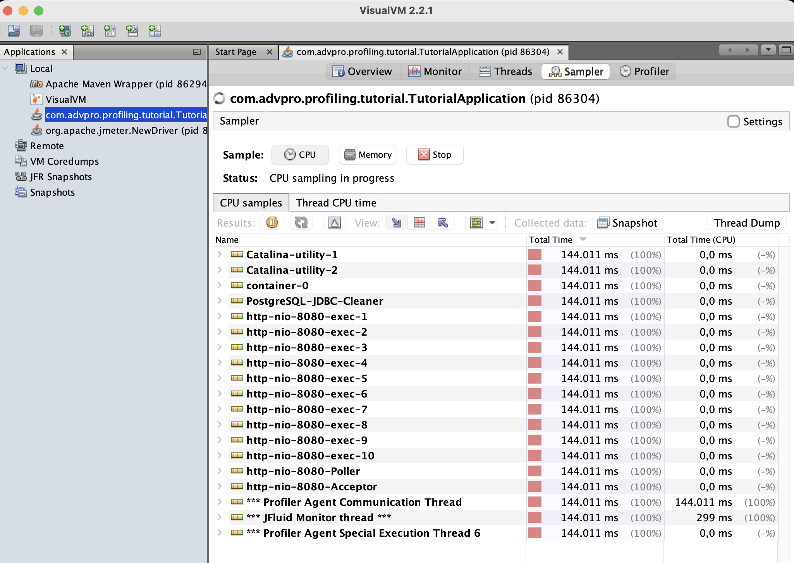
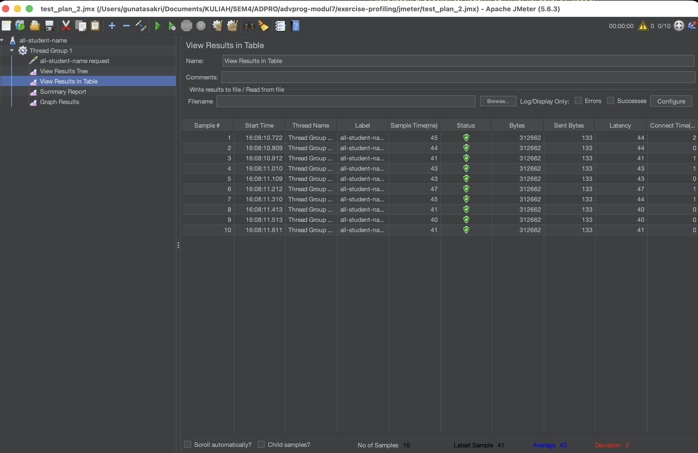
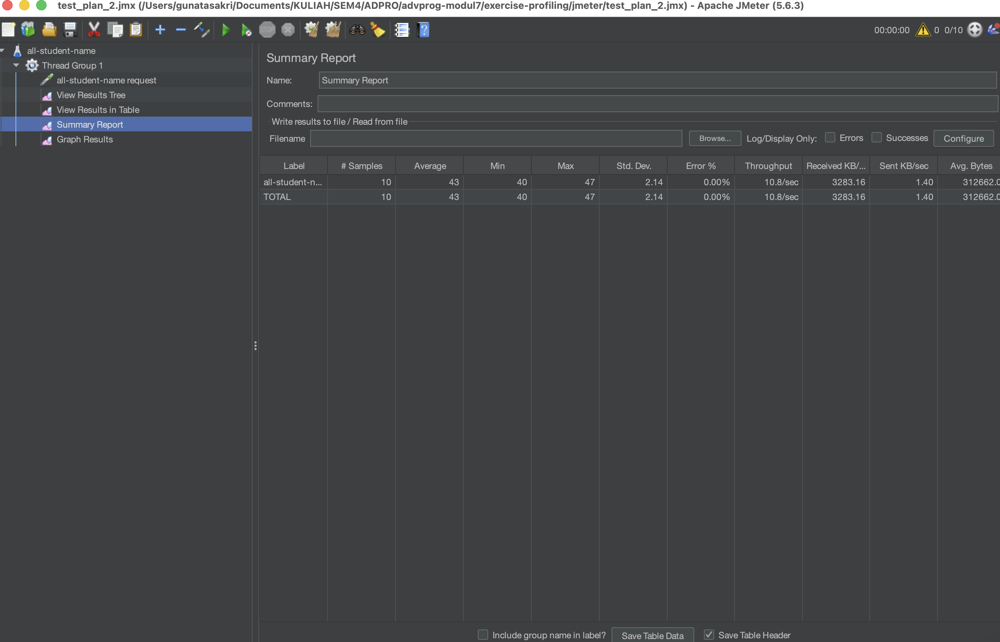
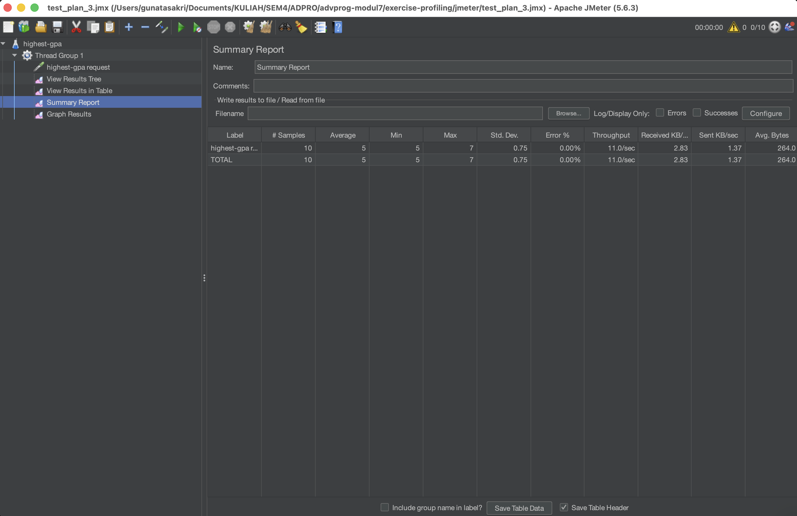

# Exercise Profiling

## Performance Testing

### JMeter GUI - /all-student-name (Before Optimization)

### JMeter GUI - /highest-gpa (Before Optimization)

### JMeter CLI - /all-student-name

### JMeter CLI - /highest-gpa

## Profiling

### Before Optimization - VisualVM Sampler

## Performance Optimization

### After Optimization - JMeter GUI /all-student-name

### After Optimization - JMeter GUI /highest-gpa

### Conclusion
After optimization, the average response time for `/all-student-name` dropped from ~444ms to ~43ms (90% improvement) and `/highest-gpa` dropped from ~47ms to ~5ms (89% improvement), both far exceeding the required 20% threshold.

## Reflection

**1. What is the difference between the approach of performance testing with JMeter and profiling with IntelliJ Profiler in the context of optimizing application performance?**

JMeter measures performance from the outside — it simulates real users hitting endpoints and records response times, throughput, and error rates. It tells you that something is slow but not why. Profiling goes inside the application at runtime to show exactly which methods consume the most CPU time and memory. In practice, I use JMeter first to confirm a performance problem exists, then profiling to find the root cause, and then JMeter again after fixing to verify the improvement.

**2. How does the profiling process help you in identifying and understanding the weak points in your application?**

The profiler showed a method list with CPU time per method. This made it immediately obvious that `getAllStudentsWithCourses` was consuming the most resources. Without profiling I would have had to guess which part of the code was slow. The method list also showed the exact execution time, which made it easy to measure the improvement after refactoring.

**3. Do you think IntelliJ Profiler is effective in assisting you to analyze and identify bottlenecks in your application code?**

Yes, it is effective. The flame graph visually shows the call hierarchy and which methods take the most time, making bottlenecks easy to spot even in a codebase you are not familiar with. The method list view with CPU time and self-time columns gives precise numbers to track improvement. Overall it significantly shortens the time needed to diagnose performance issues compared to reading the code manually.

**4. What are the main challenges you face when conducting performance testing and profiling, and how do you overcome these challenges?**

The main challenge was the N+1 query problem being hard to spot just from reading the code — the nested loop looked innocent but caused 20,001 database queries per request. I overcame this by using the profiler to see that `getAllStudentsWithCourses` was taking up the majority of CPU time, then inspecting that specific method closely. Another challenge was the JVM warmup effect — the first few runs are slower because the JIT compiler has not optimized the bytecode yet, so I ran the tests multiple times and used later measurements as the baseline.

**5. What are the main benefits you gain from using IntelliJ Profiler for profiling your application code?**

The biggest benefit is precision — instead of guessing, I get exact CPU time per method. The flame graph also shows the full call stack, so I could see not just that `getAllStudentsWithCourses` was slow, but that the time was spent inside `findByStudentId` being called repeatedly in a loop. This directly pointed to the fix: replace the per-student query with a single JOIN FETCH query.

**6. How do you handle situations where the results from profiling with IntelliJ Profiler are not entirely consistent with findings from performance testing using JMeter?**

Profiling and performance testing measure different things — profiling measures CPU time inside the JVM while JMeter measures wall-clock response time including network and I/O. A method can dominate CPU time in the profiler but have little impact on JMeter results if the bottleneck is actually I/O wait time. In that case I would look at the database query execution plans and network latency rather than pure CPU profiling data to find the real bottleneck.

**7. What strategies do you implement in optimizing application code after analyzing results from performance testing and profiling? How do you ensure the changes you make do not affect the application's functionality?**

I applied three strategies: replacing the N+1 query pattern with a single JOIN FETCH query, replacing the in-memory sort for highest GPA with a direct database query using ORDER BY and LIMIT 1, and replacing string concatenation in a loop with `Collectors.joining()`. To ensure correctness, I verified that all three endpoints returned the same data structure before and after the change and re-ran the JMeter tests to confirm both the performance improvement and a 0% error rate.
